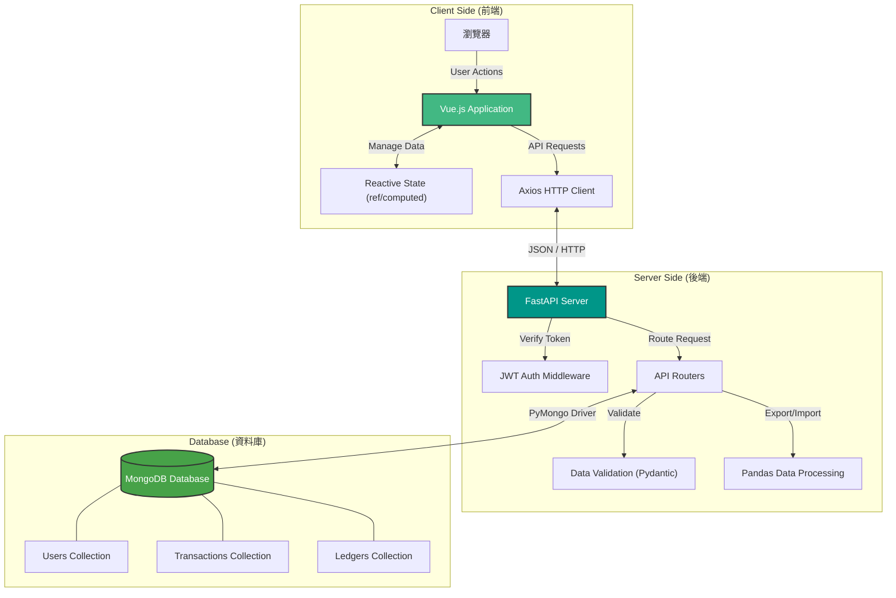
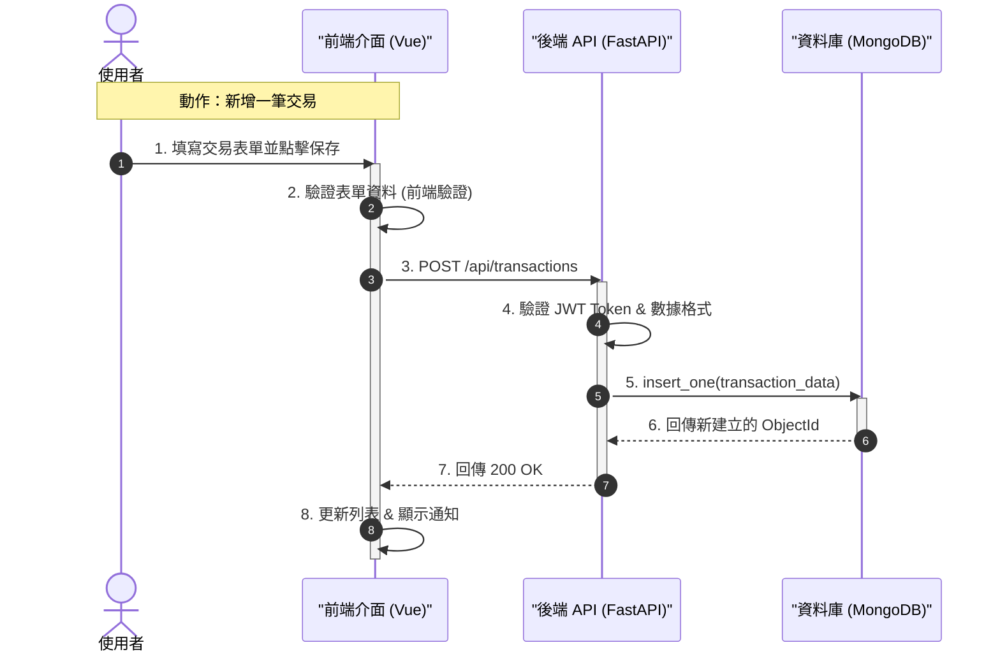

# 💰 PyMoney - 智慧協同記帳系統

<div align="center">


**一款支援多幣別、家庭共享、智慧分析的全功能記帳 Web 應用程式**

[功能特色](#-功能特色) • [快速開始](#-快速開始) • [技術架構](#-技術架構) • [API 文件](#-api-文件)

</div>

---

## ✨ 功能特色

### 💳 核心記帳
- **CRUD 完整** - 新增、編輯、刪除交易記錄
- **分類管理** - 自訂收支分類與圖示
- **多種支付方式** - 現金、信用卡、銀行、LinePay
- **備註功能** - 為每筆交易添加詳細備註

### 🌍 多幣別支援
- **16 種貨幣** - TWD, USD, JPY, EUR, CNY 等
- **即時匯率** - 自動換算外幣金額
- **原幣記錄** - 保留原始外幣金額

### 👨‍👩‍👧‍👦 家庭共享
- **邀請碼機制** - 安全邀請家人加入
- **成員管理** - 管理員可移除成員
- **共享帳本** - 查看全家庭交易記錄

### 📊 智慧分析
- **圓餅圖** - 支出分類佔比視覺化
- **趨勢圖** - 月度收支趨勢分析
- **預算追蹤** - 總預算與分類預算監控

### ⚡ 進階功能
- **快速記帳** - 模板化常用交易
- **重複交易** - 日/週/月/年自動記帳
- **匯入匯出** - CSV 匯入、Excel 匯出
- **7 國語言** - 繁中/英/日/韓/越/印尼/菲律賓

---

## Demo 影片

影片連結：https://youtu.be/FbvE-2iNmOQ

## 🚀 快速開始

### 環境需求
- Python 3.10+
- Node.js 18+
- MongoDB 6.0+

### 安裝步驟

```bash
# 1. 複製專案
git clone https://github.com/KevlnlOl7/114_tkuim_web.git
cd 114_tkuim_web/114_tkuim_final_project

# 2. 後端設定
cd backend
python -m venv venv
.\venv\Scripts\Activate.ps1  # Windows
pip install -r ../requirements.txt

# 3. 環境變數 (複製並編輯 .env)
# Windows:
copy .env.example .env

# macOS / Linux:
cp .env.example .env

# 編輯 .env 設定 MONGODB_URL 和 SECRET_KEY

# 產生 SECRET_KEY (可以使用以下 Python 指令)
python -c "import secrets; print(secrets.token_hex(32))"

# 4. 啟動後端
uvicorn main:app --reload

## 後端將運行於: `http://localhost:8000` (API 文件: `/docs`)

# 5. 前端設定 (開新終端)
cd frontend
npm install
npm run dev

## 前端將運行於: `http://localhost:5173`
```

### 預設帳號
| 角色 | 帳號 | 密碼 |
|------|------|------|
| 管理員 | `admin` | `admin` |

---

## 🏗 技術架構與流程

### 1. 專案結構
```
PyMoney/
├── backend/
│   ├── main.py              # FastAPI 應用程式入口
│   ├── database.py          # MongoDB 連線與索引
│   ├── routers/             # API 路由模組
│   │   ├── auth.py          # 認證相關
│   │   ├── transactions.py  # 交易管理
│   │   └── family.py        # 家庭功能
│   ├── services/            # 業務邏輯層
│   │   ├── auth_service.py
│   │   └── transaction_service.py
│   ├── middleware/          # 中間件
│   │   └── rate_limit.py    # API 速率限制
│   └── tests/               # 單元測試
│       ├── test_auth_service.py
│       └── test_transaction_service.py
│
└── frontend/
    ├── src/
    │   ├── App.vue          # 主應用程式
    │   ├── api.js           # API 集中管理
    │   ├── i18n.js          # 國際化設定
    │   ├── components/      # Vue 元件
    │   │   ├── LoginPage.vue
    │   │   ├── TransactionForm.vue
    │   │   ├── TrendChart.vue
    │   │   └── ...
    │   └── composables/     # 組合式 API
    │       ├── useAuth.js
    │       ├── useToast.js
    │       └── useLoading.js
    └── index.html
```

### 2. 系統架構圖



### 3. CRUD 流程圖



### 技術棧詳細
- **前端 (Frontend)**: Vue 3, Vite, Axios, Chart.js
- **後端 (Backend)**: FastAPI (Python), Pandas (資料處理)
- **資料庫 (Database)**: MongoDB (NoSQL)
- **身份驗證**: JWT (JSON Web Tokens)

---

### 設計模式應用

| 模式 | 應用場景 | 實現方式 |
|------|----------|----------|
| **Repository Pattern** | 資料存取抽象 | `database.py` 集中管理所有 MongoDB 操作 |
| **Service Pattern** | 業務邏輯封裝 | `services/` 目錄下的服務模組 |
| **Composable Pattern** | 前端狀態複用 | `composables/` 目錄下的組合式函數 |
| **Factory Pattern** | 元件動態生成 | `LanguageSelector` 支援多種變體 |

---

## 📝 使用說明

1. **註冊/登入**: 首次使用請先註冊帳號。
2. **新增帳本**: 在首頁點擊「+」新增個人或共用帳本。
3. **邀請成員**: 在帳本設定中產生邀請碼，讓家人加入。
4. **開始記帳**: 填入下方表格或使用匯入功能新增交易。
5. **查看報表**: 點擊頂部的圖表切換至統計視圖。

---
## API文件
1. Swagger UI: http://localhost:8000/docs
2. ReDoc: http://localhost:8000/redoc


## 單元測試
```bash
## 前端
cd frontend
npm test

## 後端
cd backend
python test/-v
```

## 🔄 最近更新

- ✅ **修復淨資產計算**: 修正了資產與負債的計算邏輯。
- ✅ **優化查詢效能**: 修復了共用帳本中，成員交易顯示不全的問題。
- ✅ **新增用戶篩選**: 管理員現在可以篩選特定成員的交易紀錄。
- ✅ **匯出優化**: 匯出的 Excel 表格現在包含「記帳人」欄位。

---
Developed by Kevin.
