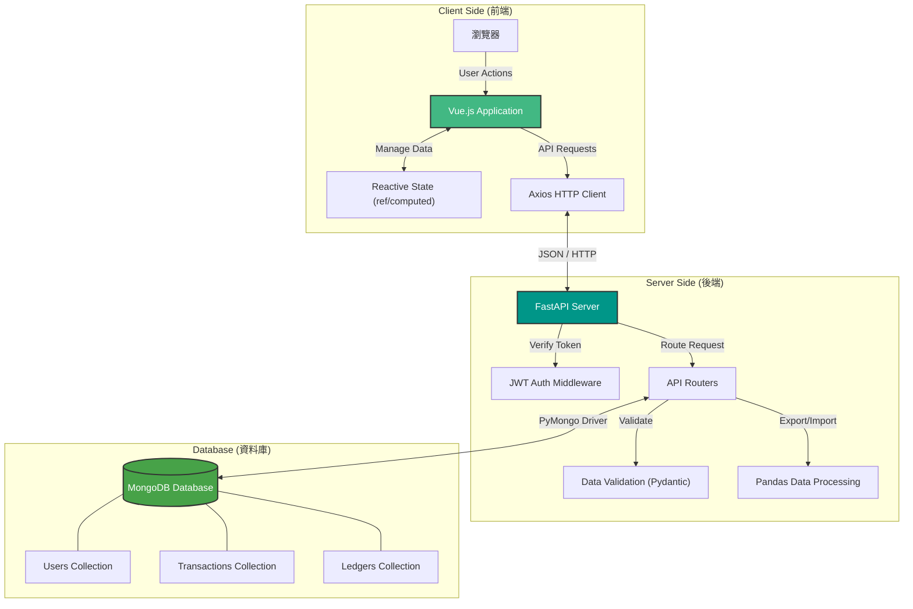
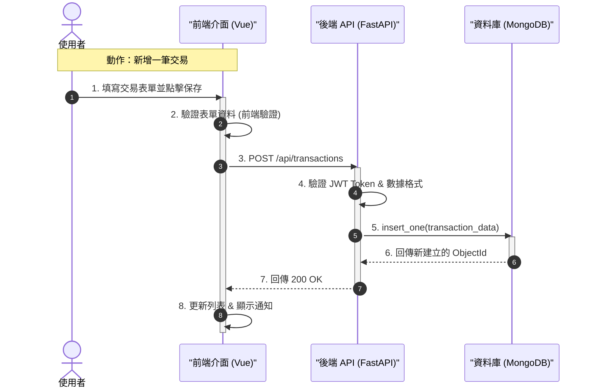

# 💰 PyMoney - 協同記帳系統

PyMoney 是一個現代化的全功能記帳應用程式，專為個人與家庭設計。支持多帳本管理、即時共用記帳、詳細的圖表分析以及 Excel 資料匯入/匯出功能。

## ✨ 主要功能 (Key Features)

### 👥 協同合作
- **共用帳本**: 創建家庭或團隊帳本，即時同步所有成員的交易。
- **權限管理**: 區分管理員與一般成員，確保資料安全。
- **用戶篩選**: 在共用帳本中，可篩選特定成員的交易紀錄 (管理員功能)。

### 📊 帳務管理
- **多帳本支援**: 同時管理個人、家庭、旅遊等多個帳本。
- **完整 CRUD**: 輕鬆新增、編輯、刪除交易。
- **資產總覽**: 自動計算淨資產（資產 - 負債），即時掌握財務狀況。
- **預算控制**: 設定月度預算，首頁即時顯示使用進度。

### 📈 數據分析
- **視覺化儀表板**: 使用圓餅圖 (Pie Chart) 與長條圖 (Bar Chart) 分析收支分佈。
- **收支趨勢**: 查看每日/每月的收支變化趨勢。

### 🔄 資料整合
- **匯入功能**: 支持 CSV/Excel 批次匯入交易，自動偵測欄位。
- **匯出報表**: 將交易紀錄匯出為 Excel 檔，並包含記帳人資訊。

---

## 🛠️ 技術架構與流程 (Architecture & Flow)

### 1. 系統架構圖 (Architecture Diagram)



### 2. CRUD 流程圖 (Data Flow)



### 技術棧詳細
- **前端 (Frontend)**: Vue 3, Vite, Axios, Chart.js
- **後端 (Backend)**: FastAPI (Python), Pandas (資料處理)
- **資料庫 (Database)**: MongoDB (NoSQL)
- **身份驗證**: JWT (JSON Web Tokens)

---

## 🚀 安裝與執行 (Installation)

### 前置需求
- Python 3.8+
- Node.js 16+
- MongoDB

### 1. 後端設定 (Backend)

```bash
cd backend

# 建立虛擬環境 (可選)
python -m venv venv
# Windows:
.\venv\Scripts\activate
# Mac/Linux:
source venv/bin/activate

# 安裝依賴
pip install -r requirements.txt

# 啟動伺服器
python -m uvicorn main:app --reload
```
後端將運行於: `http://localhost:8000` (API 文件: `/docs`)

### 2. 前端設定 (Frontend)

```bash
cd frontend

# 安裝依賴
npm install

# 啟動開發伺服器
npm run dev
```
前端將運行於: `http://localhost:5173`

---

## 📝 使用說明

1. **註冊/登入**: 首次使用請先註冊帳號。
2. **新增帳本**: 在首頁點擊「+」新增個人或共用帳本。
3. **邀請成員**: 在帳本設定中產生邀請碼，讓家人加入。
4. **開始記帳**: 點擊右下角「+」或使用匯入功能新增交易。
5. **查看報表**: 點擊頂部的圖表切換至統計視圖。

---

## 單元測試
```bash
## 前端
cd frontend
npm test

## 後端
cd backend
python test/-v
```

## 🔄 最近更新

- ✅ **修復淨資產計算**: 修正了資產與負債的計算邏輯。
- ✅ **優化查詢效能**: 修復了共用帳本中，成員交易顯示不全的問題。
- ✅ **新增用戶篩選**: 管理員現在可以篩選特定成員的交易紀錄。
- ✅ **匯出優化**: 匯出的 Excel 表格現在包含「記帳人」欄位。

---
Developed by 114 TKUIM Team.
