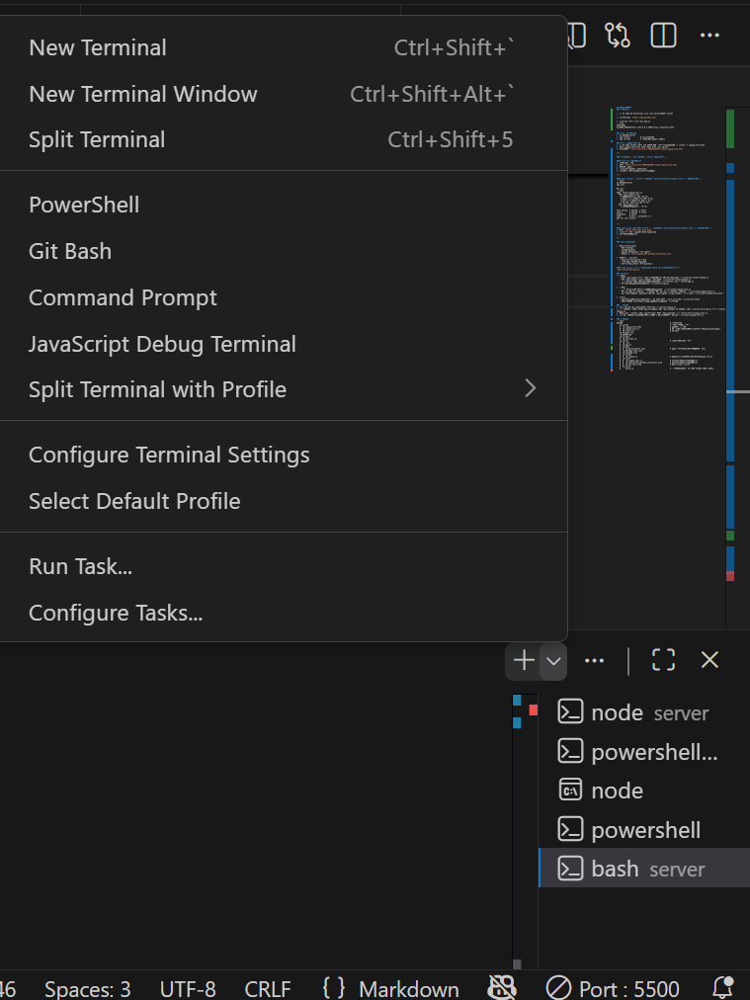

## 如何打開服務
### 前置作業

1. 在 VS Code 的 Extensions 安裝 Live Server、REST Client

2. 安裝Postman `https://www.postman.com/`

3. 在server資料夾中建立.env 並貼上
```text
PORT=3001
ALLOWED_ORIGIN=http://127.0.0.1:5500,http://localhost:5173
```

### 步驟一：啟動後端
1. cd Week09/server
2. npm install          # 安裝依賴套件
3. npm run dev          # 啟動伺服器（port 3001）

### 步驟二：如何啟動前端
1. 在 VS Code Folders 開啟 114_TKUIM_WEB 資料夾，進入Week09 -> client -> signup_form.html
2. 右鍵 signup_form.html 選擇 "Open with Live Server"
3. 會自動開啟 `http://127.0.0.1:5500/Week09/client/signup_form.html`

---

### 測試的方法 ( 請在 Week09 / server 的環境下執行 ， 且確保每個測試前 server/data/participants.json 是空的會比較好操作 )

#### 方法 1：前端介面測試
1. 啟動後端和前端
2. 開啟 `http://127.0.0.1:5500/Week09/client/signup_form.html`
3. 填寫表單並送出
4. 點擊「查看報名清單」查看結果
5. 點擊表格中的「刪除」按鈕測試刪除功能

---

#### 方法 2：Jest 單元測試
```text
cd Week09/server
npm test
```
預期輸出
```text
PASS  tests/signup_test.js
  POST /api/signup 測試
    √ 成功報名應回傳 201 (61 ms)
    √ Email 格式錯誤應回傳 400 (9 ms)
    √ 手機格式錯誤應回傳 400 (7 ms)
    √ 密碼不一致應回傳 400 (5 ms)
  GET /api/signup 測試
    √ 應成功取得報名清單 (9 ms)

Test Suites: 1 passed, 1 total
Tests:       5 passed, 5 total
Snapshots:   0 total
Time:        0.627 s, estimated 1 s
Ran all test suites.
```

---

#### 方法 3：VS Code REST Client
1. 開啟 `server/tests/api_test.http`
2. 點擊每個 `###` 上方的「Send Request」
3. 查看右側視窗的回應

---

#### 方法 4：Postman

1. 匯入 Collection：
   - 開啟 Postman
   - 進入Workspaces
   - 左上角 Workspaces 旁有 import
   - Import → `tests/Signup_API.postman_collection.json`

2. 批次執行所有測試：
   - 右鍵點擊 Collection → Run
   - 點擊「Run Week09 Signup」
   - 查看測試結果（應該 9/9 passed）

---

#### 方法 5：curl 腳本


`bash tests/test-api.sh`

預期輸出
```text
$ bash tests/test-api.sh
================================
  Week09 報名系統 API 測試
================================

[測試 1/10] 健康檢查 GET /health
tests/test-api.sh: line 31: jq: command not found

---

[測試 2/10] 查看初始清單 GET /api/signup
tests/test-api.sh: line 40: jq: command not found

---

[測試 3/10] 新增報名（成功） POST /api/signup
tests/test-api.sh: line 61: jq: command not found
tests/test-api.sh: line 64: jq: command not found
✓ 已儲存 ID:

---

[測試 4/10] 查詢單一參與者 GET /api/signup/
tests/test-api.sh: line 74: jq: command not found

---

[測試 5/10] Email 格式錯誤（應回傳 400）
tests/test-api.sh: line 93: jq: command not found

---

[測試 6/10] 手機格式錯誤（應回傳 400）
tests/test-api.sh: line 112: jq: command not found

---

[測試 7/10] 密碼不一致（應回傳 400）
tests/test-api.sh: line 131: jq: command not found

---

[測試 8/10] 未同意條款（應回傳 400）
tests/test-api.sh: line 150: jq: command not found

---

[測試 9/10] 查看所有報名 GET /api/signup
tests/test-api.sh: line 159: jq: command not found

---

[測試 10/10] 刪除報名 DELETE /api/signup/
tests/test-api.sh: line 168: jq: command not found

---

================================
  測試完成！
================================

測試項目：
  ✓ 健康檢查
  ✓ 查看初始清單
  ✓ 新增報名（成功）
  ✓ 查詢單一參與者
  ✓ Email 格式驗證
  ✓ 手機格式驗證
  ✓ 密碼一致性驗證
  ✓ 條款同意驗證
  ✓ 查看所有報名
  ✓ 刪除報名
```

### 必做項目
1. 後端：
   - POST /api/signup 驗證所有欄位，失敗時回傳 400 與錯誤訊息。 位於：server/routes/signup.js
   - GET /api/signup 回傳目前報名清單與總數。 位於：server/routes/signup.js
   - 使用 dotenv 管理 PORT、ALLOWED_ORIGIN。 位於：server/.env + server/app.js
   - 有基礎錯誤處理（404、500）。 位於：server/app.js

2. 前端：
   - 使用 fetch 串接 API，顯示成功／失敗訊息。  位於：client/signup_form.js
   - 表單送出時顯示 Loading 狀態，並防止重複送出（沿用 Week07 邏輯）。  位於：client/signup_form.js
   - 新增「查看報名清單」按鈕，呼叫 GET /api/signup 顯示結果（可用 \<pre>）。 位於：client/signup_form.html + signup_form.js

3. 測試：
   - 提供至少兩種測試方式（Postman / VS Code REST / curl 腳本）。 位於：server/tests
   - 撰寫 README 說明啟動步驟、環境需求、測試指令。 位於根目錄

### 加分挑戰
1. 套用 zod 或 yup 做更完整的資料驗證。 位於：server/signup.js
2. 將資料暫存於 JSON 檔案或 SQLite，並提供 GET /api/signup/:id 查詢。 邏輯位於：server/utils/db.js 實現位於：server/routes/signup.js
3. 撰寫 Jest / Vitest 後端單元測試，模擬 POST /api/signup。 位於：server/tests/signup_test.js
4. 於前端加入重送機制（例如伺服器錯誤時 3 秒後自動重試一次）。 位於：client/signup_form.js

### 專案結構
```text
Week09                                                # 專案根目錄
   ├─ client                                          # 前端(客戶端)資料夾
   │  ├─ signup_form.html                             # 報名表單主頁面
   │  ├─ signup_form.js                               # 表單互動邏輯（即時驗證、fetch API、LocalStorage）
   │  └─ style.css                                    # 效果bj4
   ├─ Postman.txt
   ├─ README.md
   ├─ scripts
   │  └─ test-api.sh
   ├─ server                                          # 後端(伺服器端)資料夾
   │  ├─ .env
   │  ├─ app.js
   │  ├─ data
   │  │  └─ participants.json                         # 報名資料檔案（後端自動生成並讀寫）
   │  ├─ package-lock.json
   │  ├─ package.json
   │  ├─ routes
   │  │  └─ signup.js                                 # 報名相關路由（POST/GET/DELETE、Zod 驗證）
   │  ├─ tests
   │  │  ├─ signup_test.js                            # Jest（自動化測試報名功能）
   │  │  ├─ Signup_API.postman_collection.json        # Post（自動化測試報名功能）
   │  │  └─ api_test.http                             # REST Client 測試檔
   │  └─ utils
   │     └─ db.js                                     # 資料存取模組（讀寫 JSON 檔案的 CRUD 函數）
